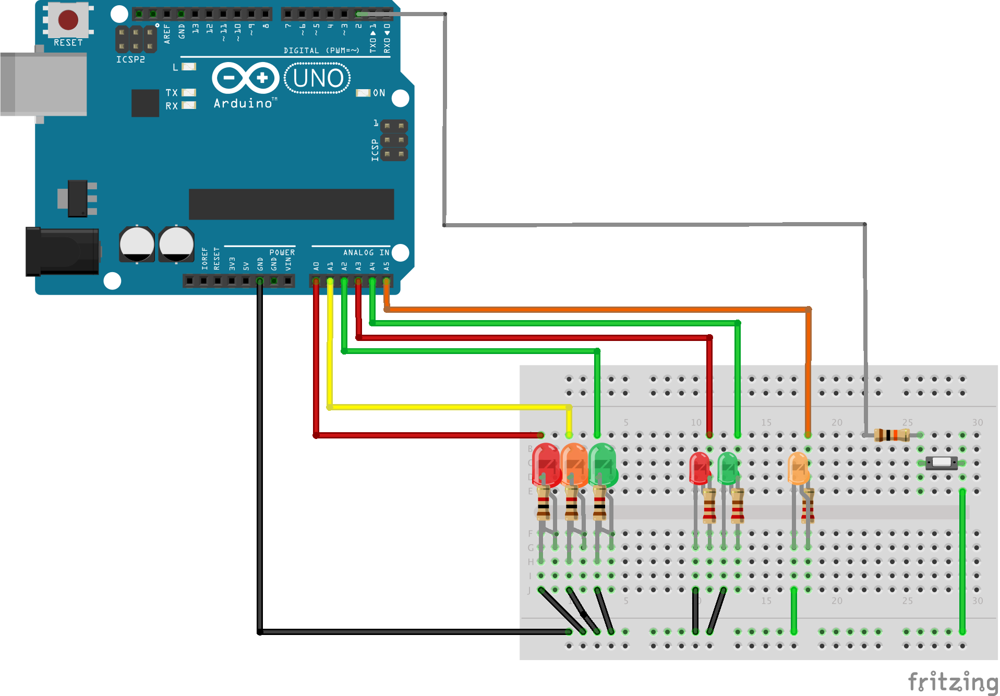

# Arduino Traffic Lights
Simple Arduino Uno based traffic light demo. There is a traffic light, pedestrian crossing lights including a wait button and indicator light.  

## Breadboard wiring pins
The example was wired as in the following fritzing diagram / code.  
`// Road`  
`int red = A0;`  
`int amber = A1; `   
`int green = A2;  `  
`// Ped  `  
`int pedRed = A3;`  
`int pedGreen = A4;`  
`int pedWaitlight = A5;`  
`int pedButton = 2;`

